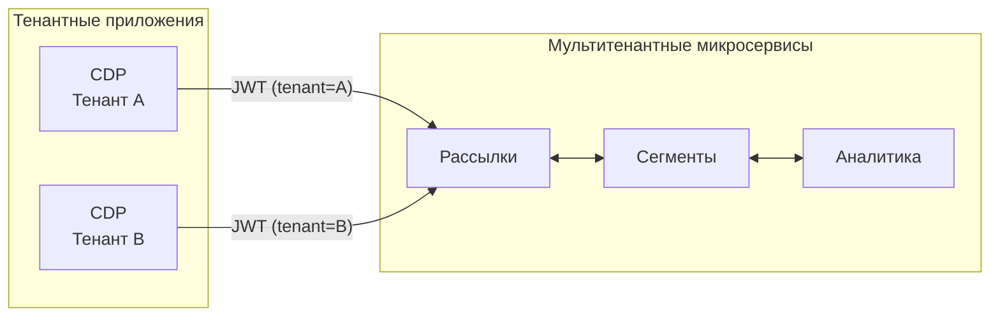
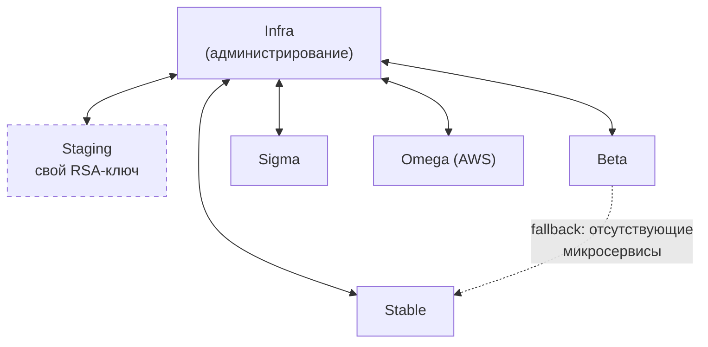
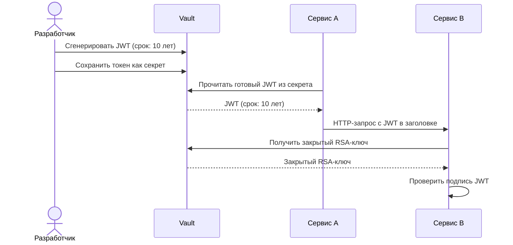
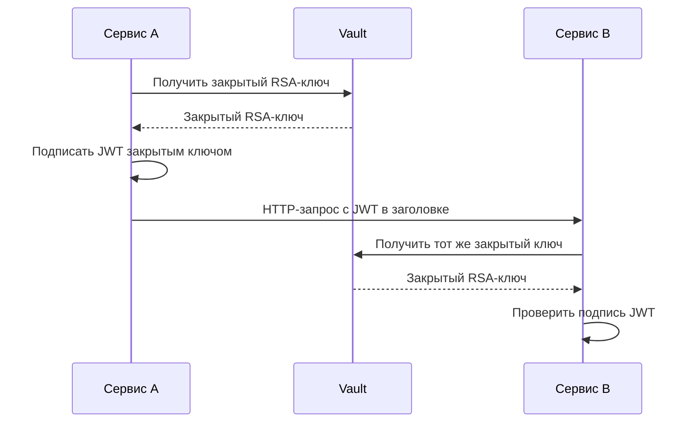

# Описание текущего устройства микросервисной авторизации в Mindbox

## Про что надо рассказать. НЕ УДАЛЯТЬ ЭТОТ ПЛАН
1. Микросервисная мультитенантная архитектура (120 микросервисов)
2. Несколько контуров с целью изоляции: 
2.1. staging (для разработчиков) 
2.2. beta (для тестирования на небольшой группе реальных пользователей)
2.3. stable (боевое самое нагруженное окружение с реальными клиентами)
2.4. sigma (новый контур для новых клиентов как stable)
2.5. omega (контур в AWS с полной изоляцией)
2.6. infra (контур с внутренней инфрастурой компании для управления проектами клиентов на вышеперечисленных контурах)
3. По факту изоляция между контурами умышленно нарушается:
3.1. infra коммуницирует со всеми контурами компании
3.2. все контура коммуницируют с infra
3.3. части микросервисов нет на beta контуре. В таком случае запросы с beta идут в stable.
4. Административная панель клиента (CDP) – тенантное приложение, развертывается для каждого клиента отдельно, но отправляет запросы к мультитенантным микросервисам.
5. JWT авторизация между сервисами в текущем варианте:
5.1. У всех приложений есть доступ к закрытому RSA ключу для подписи и проверки JWT в Vault.
5.2. Каждое приложение самостоятельно выпускает токены, централизованного контроля нет.
5.3. Закрытый ключ одинаковый на всех контурах, кроме staging, что также нарушает изоляцию.
5.4. Микросервисы могут самостоятельно выдавать пользовательский JWT.
5.5. JWT пользователя не отличается от JWT сервиса.
5.6. Для оптимизации производительности почти все приложения хранят токены в Vault со сроком действия в 10 лет. Это осложняет ротацию.
5.7. Изоляция данных клиента в мультитенантных микросервисах за счет tenant клейма в JWT.
5.8. Инструментарий для работы с авторизацией централизовано реализован в библиотеке `Mindbox.Authentication` (генерация JWT, проверка доступа) и используется во всех микросервисах.
5.9. Схема простая, разработчикам удобно ей пользоваться и быстрыми темпами развивать продукт.
5.10. Помимо микросервисов авторизацией через JWT токенами в Mindbox пользуются сторонние системы: Make, Ansible, Octopus Deploy, GitLab и т.п.

---

## Черновик секции

### Микросервисная мультитенантная архитектура

Платформа Mindbox представляет собой мультитенантную микросервисную систему, насчитывающую порядка 120 независимо развёртываемых сервисов. Каждый сервис обслуживает запросы нескольких клиентов (тенантов) одновременно, разделяя данные на уровне приложения. Единственным исключением является CDP (Customer Data Platform) — административная панель клиента, которая развёртывается для каждого тенанта отдельно, однако при обработке запросов обращается к общим мультитенантным микросервисам.

Инструментарий для работы с авторизацией централизованно реализован в библиотеке `Mindbox.Authentication`. Она предоставляет единый набор функций для генерации и проверки JWT-токенов и используется всеми микросервисами платформы.

### Схема взаимодействия CDP и микросервисов

Каждый экземпляр CDP развёрнут для конкретного тенанта и передаёт его идентификатор в claim `tenant` JWT-токена. Мультитенантные микросервисы используют этот claim для изоляции данных при обработке запроса.

### Контуры развёртывания

Для обеспечения изоляции сред и управления рисками при развёртывании платформа разделена на шесть контуров.

**Staging** — среда разработчиков. Предназначена для локальной отладки и интеграционного тестирования до попадания изменений на боевые контуры. Использует собственный набор криптографических ключей, изолированный от остальных контуров.

**Beta** — контур предрелизного тестирования на ограниченной группе реальных пользователей. Позволяет выявить дефекты в условиях, приближённых к боевой эксплуатации, до масштабного развёртывания.

**Stable** — основное боевое окружение, обслуживающее подавляющее большинство клиентов и принимающее максимальную нагрузку. Именно на этом контуре обрабатывается свыше 2 миллионов запросов в минуту.

**Sigma** — дополнительный боевой контур, функционально аналогичный stable. Создан для размещения новых клиентов и масштабирования платформы.

**Omega** — полностью изолированный боевой контур, развёрнутый в облачной инфраструктуре AWS.

**Infra** — внутренний инфраструктурный контур компании. Содержит инструменты администрирования проектами клиентов (CDP приложения) на всех вышеперечисленных контурах.

### Схема взаимодействия между контурами

### Нарушение изоляции между контурами

Несмотря на архитектурное разделение, изоляция между контурами умышленно нарушается в нескольких точках. Контур infra по своему назначению коммуницирует со всеми остальными контурами, и наоборот — сервисы на боевых контурах отправляют запросы к infra для выполнения административных операций.

Кроме того, часть микросервисов отсутствует на контуре beta. В таких случаях запросы с beta перенаправляются на stable, образуя межконтурный fallback-маршрут.

Наиболее критичным с точки зрения безопасности является то, что на всех контурах, кроме staging, используется **один и тот же закрытый RSA-ключ** для подписи и верификации JWT-токенов. Таким образом, компрометация ключа на любом из контуров автоматически ставит под угрозу все остальные. Единый ключ порождает неявное межконтурное взаимодействие: токен, выпущенный на одном контуре, валиден на любом другом, и по самому токену невозможно определить, для какого контура он предназначен. Это упрощает эксплуатацию, однако при проектировании новой системы авторизации станет одним из ключевых ограничений — ротация ключа на одном контуре не должна нарушать работу остальных.

### Текущая схема JWT-авторизации

Все 120 микросервисов платформы имеют доступ к закрытому RSA-ключу, хранящемуся в HashiCorp Vault. Централизованного контроля над выпуском токенов не существует — на практике сложились два разрозненных подхода к работе с JWT.

**Статические токены в Vault.** Для межсервисного взаимодействия, не требующего динамических данных из рантайма, разработчик вручную генерирует JWT, подписывает его закрытым ключом и сохраняет в Vault как секрет. Чтобы избежать повторной ручной генерации, срок действия таких токенов устанавливается в 10 лет. В рантайме сервис просто считывает готовый токен из Vault и использует его для запросов.

**Динамическая генерация.** Когда в токен необходимо включить данные, известные только в момент запроса (например, идентификатор тенанта или пользователя), сервис самостоятельно получает закрытый ключ из Vault и подписывает JWT в рантайме. Этот подход применяется прежде всего для пользовательских токенов.

Однако граница между двумя подходами не контролируется: любой микросервис имеет доступ к закрытому ключу и может выпустить произвольный токен — как сервисный, так и пользовательский. Схема авторизации не разделяет эти типы токенов: они имеют одинаковую структуру.

Помимо микросервисов, JWT-токены Mindbox используются сторонними системами: платформой автоматизации Make, системой управления конфигурацией Ansible, оркестратором развёртывания Octopus Deploy и CI/CD-системой GitLab. Эти внешние потребители также хранят долгоживущие токены и должны быть учтены при проектировании механизма ротации.

Описанная схема отличается простотой и удобством для разработчиков: низкий порог входа и отсутствие централизованного сервиса авторизации позволяли командам быстрыми темпами развивать продукт. Однако по мере роста платформы те же свойства превратились в архитектурные ограничения и угрозы безопасности, мотивирующие переход к новой системе авторизации.

