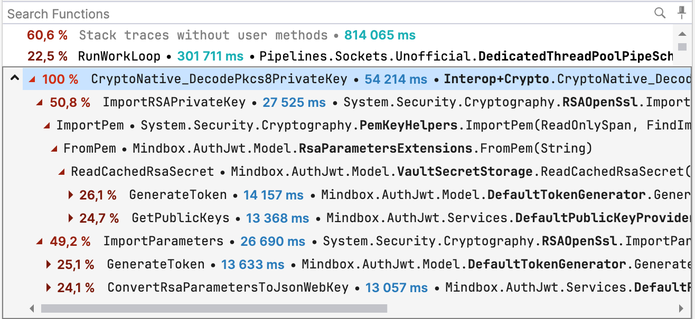

## Overview

В рамках статус пейджа из-за отказа auth-jwt выяснили, что у нас очень не оптимально используется cpu. Хотим поправить эту ситуацию.

## DODs

Минимизированы вызовы RSA.Create().

## Детали реализации

По трейсам видно, что любое взаимодействие с классом RSA - это дорогое удовольствие. Хотим кэшировать RSA/RSAParameters/SigningCredentials, чтобы снизить cpu нагрузку на мкс.
Инмемори кэша с коротким expiration должно быть достаточно.
Опционально можно сделать прогрев кэша на старте.
Подумать над тем, чтобы ReadCachedRsaSecret убрать из секрета волта.

---

Что было сделано:

Отсмотрел либу для генерации токенов, чтобы лучше понять, как можно оптимизировать генерацию токена.

Самые важные куски: генерация токена, кэш (который мы теперь юзаем) и там внутри еще пуллинг есть (без него скорее всего кэш не будет иметь смысла, можем тут упиреться).

Ссылки на код выше чисто в информационных целях. Без водки там не разобраться, да и не надо это никому.

Смигрировал формат RSA в волте.

P1, P2.

Много кода, так как переименовал всякое + всякое отрефакторил.

Side effect. Изменил алгоритм генерации kid, он теперь url friendly.

Актуальный рса хранится в RSAv2 в волте.

Теперь это просто json со всеми компонентами, как это сделано в зашаренном рса.

Это нужно чтобы избавиться от парсинга пема на каждое взаимодействие с рса:

Парсинг вызывает Openssl (дорого) и требует создание RSA (он IDisposable, так что это неудобно).

Парсинг занимал примерно 2ms на каждый ReadCachedRsaSecret.

Заюзал кэш из либы (см 1 пункт)

MR. Важны изменения в GetSigningCredentials, все остальное чисто на сдачу.

Позволило не создавать рса каждый раз, а переиспользовать пул существующих.

Итоги:

Осталась гипотеза по улучшению ситуации:

Можно управлять RSA напрямую из сервиса, а не отдавать это на откуп либе. Это будет эффективнее, так как либа создает пул рса + там есть лимиты.

Мы можем гарантировать, что в худшем случае два RSA в один момент времени.

Соответственно пул не может закончиться + нет overhead на создание RSA в начале.

Это гипотезу не будем проверять, так как:

Текущий результат считаю good enought.

Код будет просто очень ужасный (см. пункт про либу).

Сравниваю текущий результат с замером после инцидента PO и до всяких оптимизаций (но после проскейла).

RPS = 100;

Duration = 600 (s)

Environment = beta

Также на результат мог повлиять: бамп дотнета (9 -> 10), бамп либы. Это было сделано вне рамках задачи.

Снапшоты baseline.

https://grafana.mindbox.ru/dashboard/snapshot/M6mwJd9MKlyMkgxRQBEWlEA0pI9DXGAQ

https://grafana.mindbox.ru/dashboard/snapshot/vhZCqCBwscoJIT7sX7SwyfyuwR9J7hL3

https://grafana.mindbox.ru/dashboard/snapshot/igKfRQo45jCvMB9aaquU5V383lkPIPbf

https://grafana.mindbox.ru/dashboard/snapshot/5895OIBwEqwRX6UpPUDOq9l5CMBm9yqP

https://grafana.mindbox.ru/dashboard/snapshot/7VCWiS2qkZ5zuH5t7O9R8HcVgQeL8Y5t

Результаты:

DC cлой GetToken/TokenGeneration 11.4ms -> 2.15ms

Общий cpu на сервисы во время теста (после начального бурста): 2.5-2.8 -> 1.5-1.8
